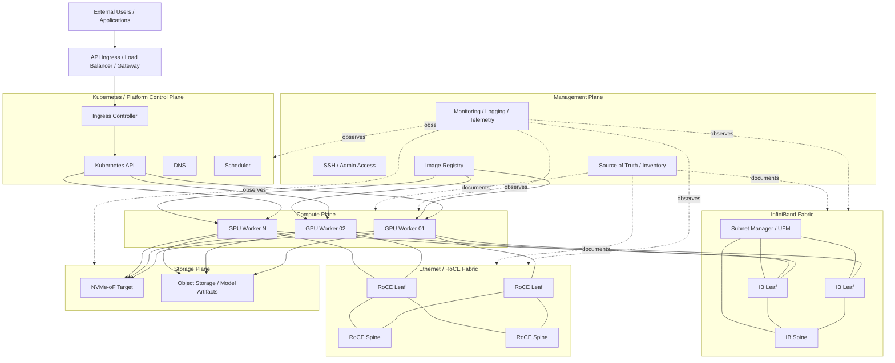

# AI Infrastructure Logical Planes

This diagram shows an AI infrastructure environment as a set of logical planes.

It is not tied to one vendor or one physical topology. The goal is to provide a reusable architecture view for design discussion, validation planning, and troubleshooting.

## How to Use This Diagram

Use this diagram to explain that AI infrastructure is not only a GPU problem.

A production-like AI platform usually needs:

- a management plane for access, inventory, images, and observability
- a platform control plane for workload scheduling and service exposure
- a compute plane for GPU workers
- one or more high-performance fabrics for GPU communication
- a storage plane for model artifacts, checkpoints, and datasets
- validation that connects network state to workload behavior

## Validation Mapping

| Plane | Example Validation |
|---|---|
| Management | SSH access, inventory accuracy, image registry access |
| Kubernetes / platform | node readiness, CNI, service and ingress reachability |
| Compute | GPU visibility, NIC visibility, NUMA/topology awareness |
| RoCE fabric | MTU, QoS, PFC, ECN, RDMA tests, NIC counters |
| InfiniBand fabric | Subnet Manager, GUID/LID discovery, P_Key, UFM events |
| Storage | model load test, checkpoint read/write, NVMe-oF path validation |
| Observability | logs, counters, alerts, topology and failure-domain views |
