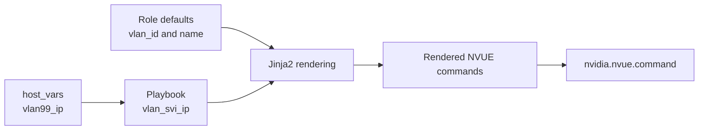
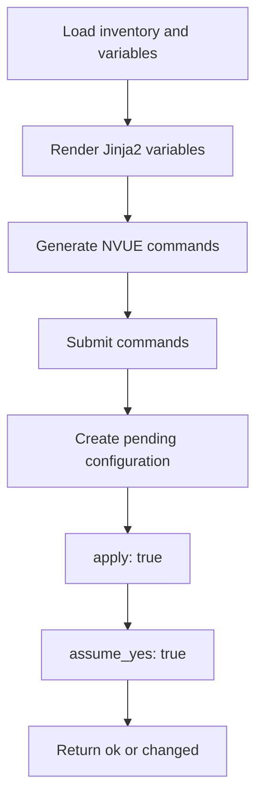

# Ansible Modules
Community based

nvidia.nvue.command # NVUE CLI

nvidia.nvue.api # NVUE REST API, some examples:
- nvidia.nvue.acl
- nvidia.nvue.bridge
- nvidia.nvue.config
- nvidia.nvue.evpn
- nvidia.nvue.interface
- nvidia.nvue.mlag
- nvidia.nvue.router
- nvidia.nvue.service
- nvidia.nvue.system
- nvidia.nvue.vrf
- nvidia.nvue.vxlan

# Recape for some concept
Inventory
A list for the objects to be managed. ini or yaml format. `inventory/hosts.ini` or 'hosts.ini'.

Host
Device in inventory

Group
A logical group of hosts

Group variable
Variable shared by a group hosts

Module
Function unit

Collection
Package of a group of module, plugin, roles

Template
content with jinja2 variables
```
template: |
  set bridge domain br_default vlan 99
  set interface vlan99 ip address {{ vlan99_ip }}
```


Register
Save a task output to a variable
```
register: vlan99_output
```

Debug
print information
```
- name: Display result
  ansible.builtin.debug:
    msg: "{{ vlan99_output['message'] }}"
```

Idemopotency
When a task is excuted multiple times, it won't create new change.

Role
Role is a usable module/package of tasks/default variable/templates/handlers/README.md

gather_facst: false
Do not collect system facts

--limit leaf01
Only apply to specified host

serial:1
One device at a time

assert
Automatically check condition

changed_when: false
Staticlly set the changed state is false.

Ansible Vault
Encription for sensitive variables


## Workflow
```
Inventory
  Define leaf01、leaf02 and variables
        ↓
Playbook
  Define the work
        ↓
Play
  Choose hosts: leaf_sw
        ↓
Tasks
  Check, config, validate
        ↓
Modules
  nvidia.nvue.command / assert / debug
        ↓
register
  Save output
        ↓
debug or/and assert
  Display result or/and check against condition
        ↓
PLAY RECAP
  ok / changed / failed / unreachable
```


### Some other notes

```yaml
- name: Configure VLAN and SVI with NVUE
  nvidia.nvue.command:
    template: |
      set bridge domain br_default vlan {{ vlan_id }}
      set interface {{ vlan_svi_name }} ip address {{ vlan_svi_ip }}
      set interface {{ vlan_svi_name }} description '{{ vlan_svi_description }}'
    apply: true
    assume_yes: true
```

Here, `template` is a parameter of the `nvidia.nvue.command` module.

It:

1. Accepts a multiline block of NVUE commands.
2. Renders Jinja2 variables.
3. Sends the rendered commands to Cumulus Linux.
4. Applies the configuration when requested.

It is not the `ansible.builtin.template` module and does not create a remote file.

---

`template: |`

```yaml
template: |
```

- `template`: a parameter of the NVUE module.
- `|`: YAML multiline literal syntax.

The following lines are passed to the module as one command block.

---

Variable rendering

Role defaults:

```yaml
vlan_id: 99
vlan_svi_name: "vlan{{ vlan_id }}"
vlan_svi_description: "Configured by Ansible role on {{ inventory_hostname }}"
```

Host variable for `leaf01`:

```yaml
vlan99_ip: 10.99.0.6/32
```

The playbook passes it into the role:

```yaml
vlan_svi_ip: "{{ vlan99_ip }}"
```

Rendered result on `leaf01`:

```text
set bridge domain br_default vlan 99
set interface vlan99 ip address 10.99.0.6/32
set interface vlan99 description 'Configured by Ansible role on leaf01'
```

Flow



---

Why quote the description?

```yaml
description '{{ vlan_svi_description }}'
```

Rendered result:

```text
description 'Configured by Ansible role on leaf01'
```

The description contains spaces, so quotes keep it as one CLI argument.

---

 `commands` versus `template`

#### `commands`

```yaml
commands:
  - "set bridge domain br_default vlan {{ vlan_id }}"
  - "set interface {{ vlan_svi_name }} ip address {{ vlan_svi_ip }}"
```

Best for:

- A small number of commands.
- Independent commands.
- A clear YAML list.

`template`

```yaml
template: |
  set bridge domain br_default vlan {{ vlan_id }}
  set interface {{ vlan_svi_name }} ip address {{ vlan_svi_ip }}
```

Best for:

- Related multiline configuration.
- Heavy use of variables.
- Jinja2 conditions or loops.
- A configuration block that resembles NVUE CLI.

Both forms support `{{ variable }}`.

---

`apply: true`

```yaml
apply: true
```

Applies the NVUE pending configuration after submitting the `set` commands.

Conceptually:

```text
nv set ...
nv set ...
nv config apply
```

Read-only `show` commands normally use:

```yaml
apply: false
```

---

`assume_yes: true`

```yaml
assume_yes: true
```

Automatically confirms the NVUE apply operation.

Use it with:

- Variable validation using `assert`.
- Initial testing using `--limit`.
- Rolling changes using `serial: 1`.
- Post-change validation.
- A rollback plan.

---

Execution flow



---

Difference from `ansible.builtin.template`

#### NVUE inline template

```yaml
nvidia.nvue.command:
  template: |
    set interface {{ interface_name }} ip address {{ interface_ip }}
```

Purpose: render and execute NVUE commands.

#### Ansible template module

```yaml
ansible.builtin.template:
  src: interfaces.j2
  dest: /etc/network/interfaces
```

Purpose: render a `.j2` template and create a remote file.

| Syntax | Purpose |
|---|---|
| `nvidia.nvue.command: template:` | Render and execute NVUE commands |
| `ansible.builtin.template:` | Render `.j2` and create a remote file |

---

Quick memory aid

```text
template: |
  Multiline NVUE command template

{{ variable }}
  Replaced with per-device data

apply: true
  Apply the NVUE pending configuration

assume_yes: true
  Automatically confirm the apply operation
```

# Ansible PRA
Production Ready Automation

Use Ansible roles + playbooks to deploy DC network. From topology, config, deployment and validation.

PRA logical structure
```
Git Repository
│
├── inventory
│   └── Device and group
│
├── group_vars / host_vars
│   └── group and host variables
│
├── roles
│   └── Reusable functions for hostname、DNS、FRR、interfaces、SNMP .etc
│
├── templates
│   └── for generating config
│
├── playbooks
│
├── backup / restore
│
└── validation / CI
```

Data flow

```
Inventory
    +
group_vars / host_vars
    ↓
Playbook selects hosts and roles
    ↓
Role runs tasks
    ↓
Jinja2 template reads variables
    ↓
Generate candidate configuration
    ↓
Check / diff / validation
    ↓
Deploy to switches
    ↓
Handler reloads service
    ↓
Post-change validation
```
